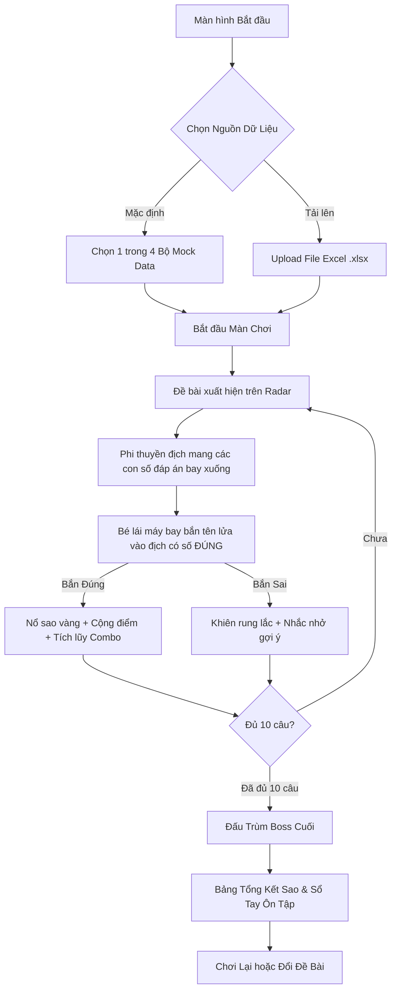

# 🚀 KỊCH BẢN THIẾT KẾ GAME: CHIẾN CƠ TOÁN HỌC (MATH SKY STRIKER)
> **Tài liệu Thiết kế Game (Game Design Document - GDD)**  
> **Dành cho đối tượng:** Học sinh Tiểu học (Lớp 1 – Lớp 5)  
> **Nền tảng mục tiêu:** Web Game chạy trực tiếp trên 01 file `.html` (Standalone, không cần cài đặt server, hỗ trợ PC, Laptop và Tablet).

---

## 1. TỔNG QUAN DỰ ÁN (PROJECT OVERVIEW)

- **Tên trò chơi:** **Chiến Cơ Toán Học: Vệ Binh Ngân Hà (Math Sky Striker)**
- **Thể loại:** Bắn máy bay Arcade vui nhộn (Top-down Shooter) kết hợp Giáo dục Toán học (EdTech Gamification).
- **Mục tiêu cốt lõi:** Biến việc rèn luyện tính toán khô khan (cộng trừ có nhớ 3 chữ số, bảng cửu chương nhân/chia) thành một cuộc phiêu lưu hành động đầy phấn khích, kích thích phản xạ tính nhẩm và tư duy logic của trẻ.
- **Tiêu chí thiết kế:**
  - *Vừa học vừa chơi (Playful Learning):* Cân bằng hoàn hảo giữa tính giải trí và thời gian suy nghĩ làm bài; tuyệt đối không tạo cảm giác ức chế hay áp lực thời gian quá nặng nề.
  - *Đồ họa Chibi thân thiện:* Màu sắc tươi sáng, hiệu ứng rực rỡ vui mắt, không bạo lực (bắn nổ ra kẹo ngọt, ngôi sao, bong bóng).
  - *Tiện ích cho Phụ huynh & Thầy cô:* Tự động sinh đề bài chuẩn sư phạm hoặc tùy biến 100% bằng cách import file Excel.

---

## 2. CỐT TRUYỆN & THẾ GIỚI TRÒ CHƠI (THEME & STORY)

- **Bối cảnh:** Tại Ngân Hà Tri Thức, biệt đội "Quái Vật Số Hỏng Hóc" (Glitch Bots) do Trùm Ma Trận dẫn đầu đang làm xáo trộn các con số của các hành tinh, khiến mọi trật tự toán học bị đảo lộn.
- **Vai trò người chơi:** Bé sẽ vào vai **Cơ Trưởng Nhí (Star Captain)** điều khiển phi thuyền "Sao Băng Siêu Đẳng" (Starlight Jet), sử dụng "Pháo Năng Lượng Chân Lý" để giải mã và bắn hạ các tàu địch mang đáp án sai, bắt giữ đúng phi thuyền mang đáp án chuẩn để khôi phục trật tự vũ trụ.

---

## 3. CƠ CHẾ GAMEPLAY CHI TIẾT (GAME MECHANICS)

### 3.1. Nghịch lý Game Bắn máy bay x Toán học & Giải pháp thiết kế
> **Vấn đề thường gặp:** Trong game bắn súng, nhịp độ nhanh khiến trẻ chỉ mải né đạn và bắn bừa mà không kịp nhẩm phép tính.
>
> **Giải pháp đột phá của "Math Sky Striker":**
> 1. **Nhịp điệu "Bay tuần tra - Phép tính xuất hiện - Khóa mục tiêu":** Khi phép tính xuất hiện, tốc độ lướt của địch chậm lại vừa phải (có đồng hồ đếm ngược thân thiện hoặc tốc độ hạ cánh từ từ).
> 2. **Cơ chế Khóa Mục Tiêu & Bắn Trực Quan:**
>    - Trên đỉnh màn hình (hoặc Radar chỉ huy): Hiện phép tính lớn rõ nét (Ví dụ: `348 + 275 = ?`).
>    - Trên chiến trường: Xuất hiện 3 đến 4 phi thuyền địch mang các đáp án lựa chọn bay xuống theo đội hình (Ví dụ: `613`, `623`, `523`, `633`).
>    - Người chơi di chuyển phi cơ sang trái/phải, hướng nòng súng vào **kẻ địch mang đáp án ĐÚNG** và nhấn bắn tên lửa!
> 3. **Pháo Tự Động / Nhấn Bắn (Smart Shoot):** Trẻ có thể dùng phím mũi tên / chuột / chạm ngón tay để lái phi thuyền. Bắn trúng tàu đúng thì tàu đó được giải mã biến thành ngôi sao thưởng; bắn trúng tàu sai thì đạn dội ra hoặc tàu chỉ rung lắc cảnh báo mà không làm nản lòng bé.

### 3.2. Chế độ điều khiển (Control Scheme)
- **Chuột / Cảm ứng Touch (Ưu tiên số 1):** Di chuyển phi cơ theo con trỏ chuột/ngón tay, click để phóng tên lửa (hoặc tự động bắn khi bay thẳng hàng với mục tiêu).
- **Bàn phím:** Phím mũi tên $\leftarrow$ $\rightarrow$ (hoặc `A` / `D`) để lướt phi thuyền, phím `Space` (Cách) để bắn tên lửa. Phím số `1`, `2`, `3`, `4` tương ứng với việc phóng tên lửa tự tìm mục tiêu 1-2-3-4 (dành cho bé muốn phản xạ nhanh).

### 3.3. Các Màn Chơi & Vòng Đấu (Level Structure)
1. **Màn Thường (Wave Attack):** Gồm 5 - 10 câu hỏi/đợt quái. Mỗi đợt có 1 bài toán và 3-4 tàu địch mang đáp án rơi xuống.
2. **Màn Cứu Viện (Rescue Orbit - Đố Nhanh):** Xuất hiện thiên thạch mang câu hỏi trắc nghiệm đúng/sai hoặc điền số còn thiếu (Ví dụ: `7 x ? = 56`), bắn phá thiên thạch để nhận hộp quà nâng cấp.
3. **Màn Đấu Trùm (Boss Battle):** Cứ mỗi 10 câu sẽ gặp **Trùm Robot Ma Trận**. Trùm có 3 vạch năng lượng, phóng ra các câu đố thử thách (Ví dụ: chuỗi phép tính có nhớ 3 chữ số). Bé phải bắn trúng 3 lần đáp án đúng để kích hoạt "Đại bác Cầu Vồng" hạ gục Trùm.

---

## 4. THIẾT KẾ TOÁN HỌC & SƯ PHẠM (PEDAGOGICAL DESIGN)

### 4.1. Hệ thống Phép Tính Sẵn Có (Mock Data Engine)
Khi chưa tải file Excel, game tích hợp sẵn 4 bộ chế độ toán học theo chuẩn chương trình Tiểu học:

1. **Phép Cộng có nhớ trong phạm vi 1000 (3 chữ số):**
   - Dạng: $ABC + DEF$ với quy tắc có nhớ 1 lần hoặc 2 lần (hàng đơn vị hoặc hàng chục).
   - *Ví dụ:* $358 + 267 = 625$, $489 + 134 = 623$.
2. **Phép Trừ có nhớ trong phạm vi 1000 (3 chữ số):**
   - Dạng: $ABC - DEF$ (với $ABC > DEF$, mượn 1 ở hàng chục hoặc hàng trăm).
   - *Ví dụ:* $724 - 358 = 366$, $500 - 247 = 253$.
3. **Bảng Cửu Chương Toàn Tập (Nhân & Chia 2 $\to$ 9):**
   - Dạng nhân: $7 \times 8 = 56$, $9 \times 6 = 54$,...
   - Dạng chia: $72 : 9 = 8$, $42 : 6 = 7$,...
4. **Chế độ Hỗn Hợp Siêu Cấp (Thử thách tài năng):**
   - Trộn ngẫu nhiên cả cộng, trừ, nhân, chia.

### 4.2. Thuật toán Sinh "Đáp Án Bẫy" Thông Minh (Smart Distractors)
Trẻ con thường mắc các lỗi sai kinh điển khi tính nhẩm:
- Quên nhớ 1 (ra kết quả thiếu 10 hoặc thiếu 100).
- Nhớ nhầm sang hàng bên cạnh (dư 10).
- Nhầm dấu $+$ thành $-$ hoặc ngược lại.
- Bảng cửu chương nhớ nhầm kết quả liền kề (Ví dụ: $7 \times 8 = 56$ nhưng nhầm thành $54$ hoặc $63$).
$\implies$ **Game tự động tạo ra các đáp án sai dựa trên chính các bẫy tâm lý này**, giúp trẻ rèn luyện tính cẩn thận và khắc sâu kiến thức hơn là sinh số ngẫu nhiên vô nghĩa.

---

## 5. CHỨC NĂNG IMPORT FILE EXCEL (EXCEL CUSTOMIZATION)

Giáo viên và phụ huynh có thể tự soạn đề bài theo chương trình học trên lớp để bé ôn tập.

### 5.1. Cấu trúc File Excel (.xlsx / .csv)
File Excel cực kỳ đơn giản với 5 cột cơ bản:

| Cột A: STT | Cột B: Đề bài (Phép tính) | Cột C: Đáp án Đúng | Cột D: Đáp án Bẫy 1 | Cột E: Đáp án Bẫy 2 | Cột F: Lời gợi ý/Nhắc nhở (Tùy chọn) |
| :---: | :---: | :---: | :---: | :---: | :---: |
| 1 | `245 + 378` | `623` | `613` | `523` | *Nhớ 1 sang hàng chục và hàng trăm nhé!* |
| 2 | `8 x 7` | `56` | `54` | `64` | *Bảng nhân 8: 8 nhân 7 bằng 56.* |
| 3 | `902 - 456` | `446` | `456` | `546` | *Không trừ được thì mượn 1 ở hàng trước nhé!* |

- *Tính năng tự động:* Nếu giáo viên chỉ điền Cột B và Cột C, hệ thống sẽ tự động tạo đáp án bẫy D và E!
- *Nút "Tải File Mẫu":* Ngay trên giao diện có nút bấm tải về file `mau_de_toan.xlsx` để người lớn chỉ việc mở lên nhập đề bài.
- *Công nghệ xử lý:* Đọc trực tiếp trên trình duyệt bằng thư viện `SheetJS (xlsx.full.min.js)` tải từ CDN hoặc bundle offline sẵn, không gửi dữ liệu lên server, bảo mật 100%.

---

## 6. ĐỒ HỌA, GIAO DIỆN (UI/UX) & ÂM THANH

### 6.1. Phong cách Đồ họa (Visual Style)
- **Gam màu chủ đạo:** Xanh vũ trụ đậm (Navy/Deep Space) làm nền, các đối tượng mang màu sắc Neon rực rỡ (Vàng nắng, Cam rực, Xanh ngọc, Hồng kẹo) giúp trẻ tập trung thị giác tối đa.
- **Phong cách vẽ:** Chibi Vector mượt mà bằng HTML5 Canvas:
  - *Phi thuyền của bé:* Tròn trịa, cánh vát mềm mại, đuôi phun lửa hào quang hạt sáng lấp lánh.
  - *Quái vật địch:* Hình dáng ngộ nghĩnh (Bạch tuộc một mắt, Robot bánh bao, Đĩa bay kẹo mút) với số đáp án hiển thị to rõ trên thân.
  - *Hiệu ứng bắn trúng (Juicy FX):* Không bạo lực. Khi bắn trúng địch đúng, địch bung nở thành pháo hoa sao vàng lấp lánh `+100 ĐIỂM!`, kèm chữ khen ngợi bay lên: *"XUẤT SẮC!", "CHÍNH XÁC!", "SIÊU NHẨM!".*

### 6.2. Giao diện Người Dùng (Kid-Friendly UI)
- **Font chữ:** Dùng font bo tròn, chân phương, dễ đọc cho học sinh tiểu học (như `Nunito`, `Baloo 2` hoặc `Quicksand`).
- **Bảng HUD:**
  - Góc trên cùng: Bảng đề bài dạng Tivi Không Gian to rõ, tương phản cao.
  - Góc trái: Cột Tim máu (3 quả tim dễ thương) + Thanh điểm số.
  - Góc phải: Chuỗi Combo đúng liên tiếp (Streak x2, x3) + Nút Tạm Dừng / Cài đặt âm lượng.
- **Màn hình Tổng kết (Victory Report):**
  - Đánh giá sao (1 đến 3 Sao vàng lấp lánh).
  - Bảng "Sổ Tay Chiến Công": Thống kê số câu đúng, câu làm sai kèm lời giải từng bước để bé xem lại và rút kinh nghiệm ngay.

### 6.3. Âm thanh Thần Kỳ (Audio via Web Audio API)
- Sử dụng **Web Audio API** tổng hợp trực tiếp từ mã code (chạy 100% offline, không phụ thuộc file mp3 ngoài, không bị lỗi CORS hay lỗi chặn phát tự động của trình duyệt):
  - Tiếng đạn laser: *Pew pew* vui tai.
  - Tiếng bắn trúng đáp án đúng: Âm thanh chuông đồng vang rộn rã (*Ting-ting-keng!*).
  - Tiếng bắn trúng đáp án sai: Tiếng bong bóng dội ngược nhẹ nhàng (*Boing!*), không gây hoảng sợ.
  - Nhạc nền nhẹ nhàng, kích thích sóng não tập trung giải toán.

---

## 7. YẾU TỐ GAMIFICATION & GIỮ CHÂN TRẺ (ENGAGEMENT)

1. **Trạng thái "Fever Mode" (Chiến Cơ Siêu Cấp):**
   - Khi trả lời đúng liên tiếp 3 câu không sai, phi thuyền chuyển sang trạng thái "Hóa Vàng", tốc độ tên lửa nhanh gấp đôi, đạn đổi thành Tên Lửa Cầu Vồng và nhân đôi số điểm.
2. **Nhà Kho Phi Thuyền (Hangar & Skins):**
   - Dùng điểm tích lũy qua các bài toán để đổi màu phi thuyền: *Phi Thuyền Phượng Hoàng Lửa, Phi Thuyền Cá Voi Xanh, Phi Thuyền Sấm Sét.*
3. **Danh hiệu Thần Đồng:**
   - Hoàn thành các cột mốc để mở khóa huy hiệu: *Bậc Thầy Cửu Chương, Thần Tốc Tính Nhẩm, Xạ Thủ Không Gian.*

---

## 8. KIẾN TRÚC KỸ THUẬT SINGLE-FILE HTML (.html)

- **Đóng gói toàn bộ trong 01 file duy nhất `index.html`:**
  - `HTML5`: Cấu trúc ngữ nghĩa, Canvas game 60FPS.
  - `CSS3`: Giao diện hiện đại, Glassmorphism bo tròn, hiệu ứng rung lắc (screen shake) và hoạt ảnh nút bấm thân thiện.
  - `Vanilla JavaScript`: Game loop hiệu năng cao, động cơ vật lý hạt (Particle System), thuật toán toán học sinh đề, audio synthesizer.
  - `Thư viện nhúng`: Nhúng thư viện đọc Excel qua thẻ CDN (có fallback sang Mock data nếu chạy máy tính không có internet).
- **Trọng lượng siêu nhẹ:** Khởi động tức thì dưới 1 giây, tương thích mọi trình duyệt Chrome, Edge, Safari, Firefox.

---

## 9. QUY TRÌNH TRẢI NGHIỆM NGƯỜI DÙNG (USER FLOW)

---

## 10. KẾT LUẬN & ĐỀ XUẤT PHÊ DUYỆT

Kịch bản trên kết hợp nhuần nhuyễn giữa:
1. **Tính sư phạm**: Đúng trọng tâm toán tiểu học (cộng trừ có nhớ 3 chữ số, bảng cửu chương, cơ chế sinh bẫy thông minh).
2. **Tính giải trí**: Không gây áp lực, nhịp độ vừa vặn để trẻ vừa quan sát, vừa nhẩm tính, vừa tận hưởng cảm giác lái chiến cơ bắn hạ mục tiêu.
3. **Tính tiện dụng**: Chạy ngay lập tức trên mọi máy tính/tablet chỉ bằng 1 file HTML, nạp đề bài dễ dàng bằng Excel.

👉 **Xin mời Bạn xem qua kịch bản chi tiết này. Khi Bạn phê duyệt, chúng ta sẽ bắt tay ngay vào việc lập trình file game `.html` hoàn chỉnh!**
